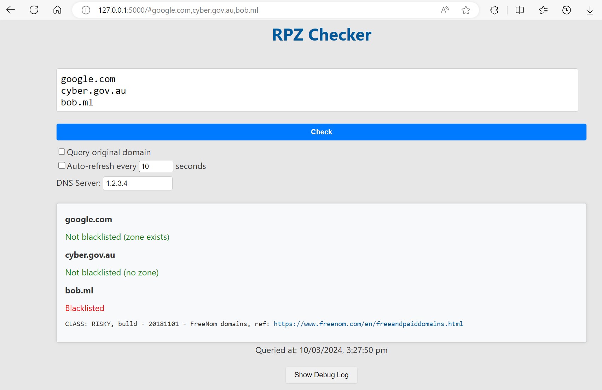

# RPZ Checker

RPZ Checker allows you to check if one or more domains are list on an RPZ blacklist.

## Getting started

1. **Ensure Python3 is installed.**
   
   If it's not, download from [here](https://www.python.org/downloads/).

2. **Clone or [download](https://github.com/qldtmr/rpz-checker/archive/refs/heads/main.zip) this repository.**

   ```
   git clone https://github.com/qldtmr/rpz-checker.git
   ```

3. **Install dependencies.**

   ```
   cd rpz-checker
   pip install -r requirements.txt
   ```

4. **Run.**

   ```
   python app.py
   ```

   `http://127.0.0.1:5000/` should open in your web browser.

## Usage

Enter one or more domains and hit <kbd>Enter</kbd> or click **Check**. Multiple lines can be entered with <kbd>Shift</kbd> + <kbd>Enter</kbd>.

